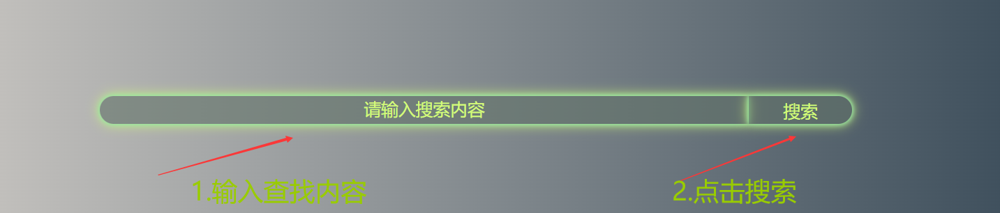
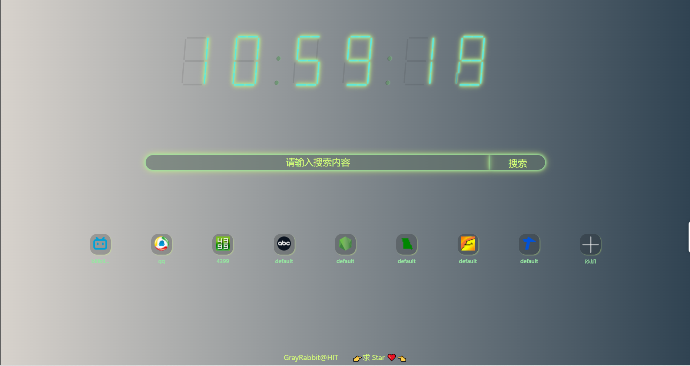
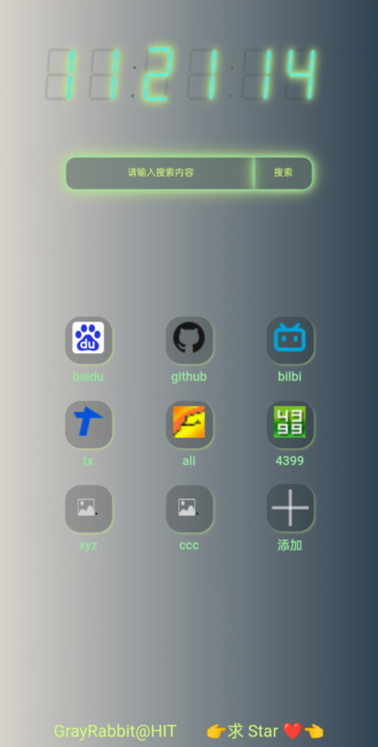

# 标签页

## 使用：

访问 **gray-rabbit.tech** 🏄 或者下载本项目并在本地进行打包📦。

## 功能：

- **搜索**：可以通过输入关键词 ⌨️ 点击搜索 🔍来进行内容的检索。

  （搜索引擎目前使用的Bing，后续将使用用户默认的搜索引擎）

  
搜索步骤
 

- **收藏夹**：可以通过输入web名称和webURL来对网站进行收藏✨。

  

  
PC效果图
 

  

  
mobile效果图
 

  支持的URL格式如下😎：

  1. https://www.example.com
  2. http://www.example.com
  3. www.example.com
  4. example.com
  5. http://blog.example.com
  6. http://www.example.com/product
  7. http://www.example.com/products?id=1&page=2
  8. http://www.example.com#up
  9. http://255.255.255.255
  10. 255.255.255.255
  11. http://www.site.com:8008

- **时间**：可以通过一个炫酷🆒的时钟⏰得知现在的时间。

